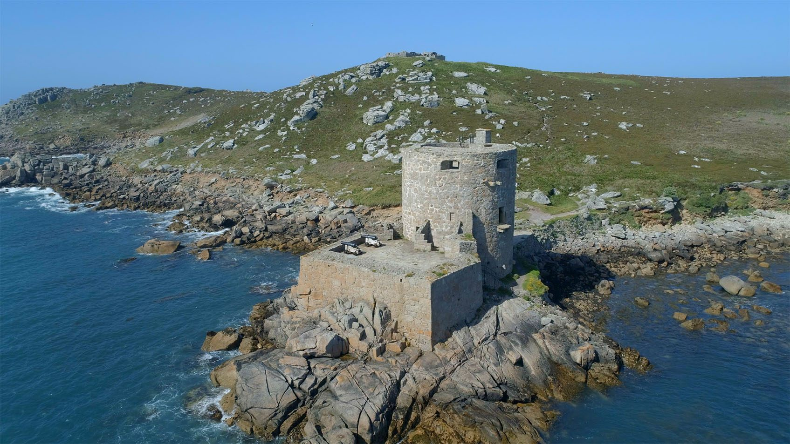

# THE OLDEST INHABITANT
Then there is the mackerel fishery, which is at its height in May
and June, when St. Mary’s Pool is full of the picturesque, brownsailed fishing-boats from Mount’s Bay.
The other “industry” mentioned by the boatmen, that is to say
“visitors,” is carried on intermittently all through the year, but is
naturally most active during the spring and summer months.
In the summer there are cheap day-excursions from the mainland,
and crowds of trippers arrive at St. Mary’s by steamer to spend a
few hours on the islands. Some of them land in such a woebegone
condition that they are fit for nothing but to lie about on the
benches in the “Park” until the hoot of the steamer rouses them to
crawl back to the quay. Others, more courageous in spite of having
had a “sick transit,” will only stop to snatch a morsel of food
before rushing off to the steam-launch for Tresco, where they will
make the round of the famous gardens, walk perhaps to
Cromwell’s Castle

and return to St. Mary’s dead-beat, just in time
to go on board for the homeward journey. And they call that a
day’s holiday! But these are not the visitors to bring grist to the
boatman’s mill. The kind he wants are those who come to stay,
those who come again year after year, and who delight in sailing
about amongst the islands and learning to know and love them well. They do not come
looking for “Entertainments,” with a capital E. They are quite
content with the magical music of the wind and the waves, and
with the natural beauties that surround them on every side.
These visitors are neither so many nor of such a kind as to take
away from the peaceful charm of the place. You can always get 
peace and quiet in Scilly, even in the most “tripperish” season, for
the trippers follow a beaten track which it is easy enough to avoid.
And the islands are, fortunately, quite unspoilt by any efforts to
cater for their supposed wants. Not a single penny-in-the-slot
machine flaunts its vermilion and yellow in your face; there are no
niggers on the beach, nor brass bands, nor cinematographs; no
dancing on the pier; no “marine parades” or “esplanades”; above
all, here are no artificial “natural attractions” (most hateful of
paradoxes), no manufactured show-places to pander to perverted
taste. If you come hoping for these things, you will go away (and
the sooner the better for all concerned) disappointed. You would
only be an alien in this little Paradise.
There are many who will sympathise with this description of the
islands taken from a visitor’s book: “A Paradise surpassing
Dante’s ideal, but alas! only to be attained by passing through three
and a half hours of Purgatory.” For the voyage from Penzance to
Scilly is not one to be treated lightly. Looked upon as a pleasure
trip, it may be enjoyable or the reverse, according to the weather
and the constitution of the passenger; but considered in the light of
a test of “good-sailor”-ship it is, I think, without a rival. Do not be
set up because you have travelled unscathed to Australia and back,
or crossed to America without turning a hair. This little bit of the
Atlantic may yet humble you! There seems to be something in the
cross-currents between Scilly and the Land’s End which tries the
endurance of even the most hardened sailors. How often does one
hear it said in Scilly, “I used to think I was a good sailor, but——”;
and that “but” speaks volumes! Even sea-captains, regular old seadogs 
who have spent a lifetime afloat, have been known, to their
shame and disgust, to fall victims to Neptune on the Scilly passage.
I never made a voyage in which less (or should I say more?) was
expected of you. The steward gives you a friendly peep at
intervals. “Feeling all right, I hope?” You never felt better in your
life, and say so. “Well, please hold out as long as you can; my
supply is limited.” And you almost feel that it would be 
ungenerous to disappoint his evident expectations by “holding out”
to the end!
But what matters three and a half hours of Purgatory when once
one has attained to Paradise? And the passage weighs as nothing in
the scale against the charms of Scilly.
In the “good old days” things were very different from what they
are now. You could not then make a return journey in the same
day. Sailings were few and far between, and people prepared for
going to Scilly as for a long voyage.
In Lieutenant Heath’s time (1744) the passage was seldom made
more often than once a month or six weeks in summer, and not so
often in winter; and he says that as it was made “in small open
fisher-boats amidst the running of several cross-tides, the
passengers are forced to venture at the extreme hazard of their
lives when necessity or duty calls them.” And these passengers
“should be qualified,” he continues, “to endure wetting or the
weather like so many Ducks; however, the Boatman undertakes to
empty the water with his Hat or what comes to Hand without the
least Concern.” Half a century later Troutbeck writes that the
inhabitants “want a constant, regular, and even monthly
communication with England,” chiefly for the sake of getting food.
A strong proof of the uncertainty that attended the journey in those days is that in
1793 the “Prudence and Jane,” coming from Penzance to Scilly
with necessaries, was driven by a contrary wind to Cherbourg in
France! Nowadays it may happen in very exceptionally stormy or
foggy weather that a Scillonian’s Sunday dinner does not arrive till
Monday, but at least it never goes to France!

